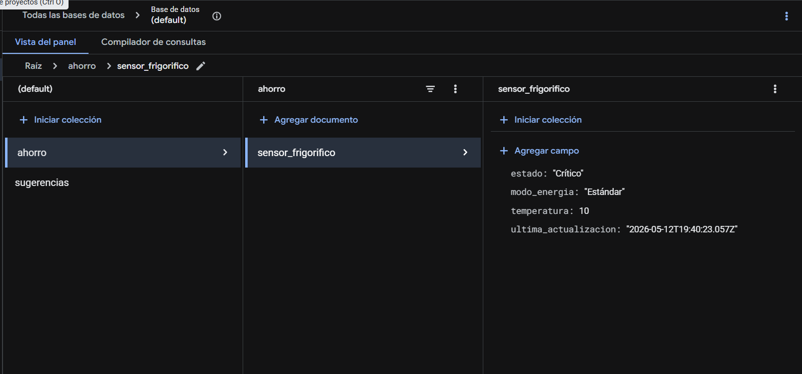
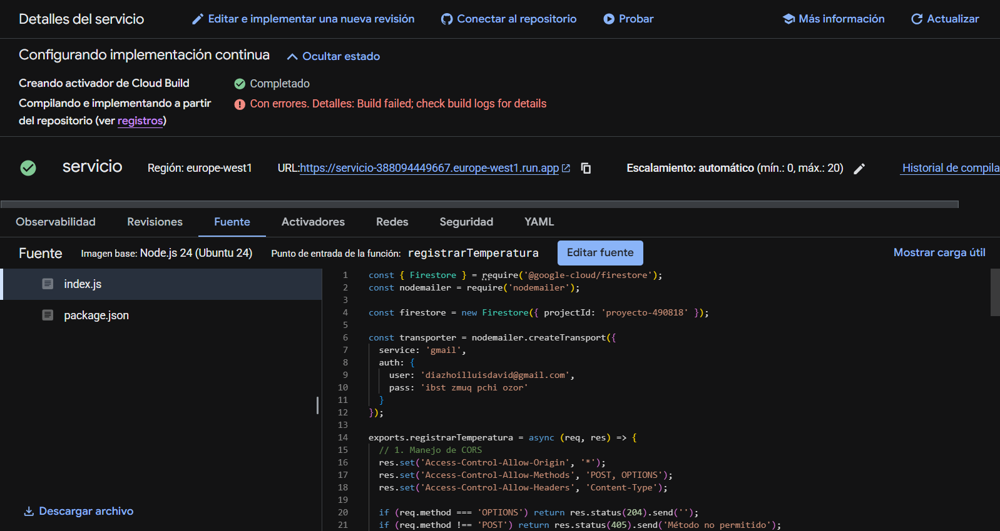
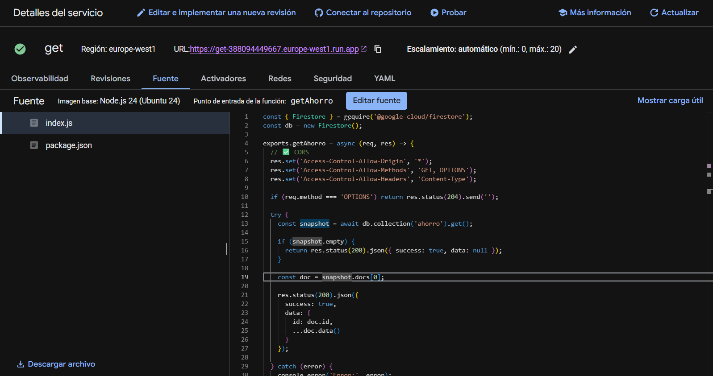
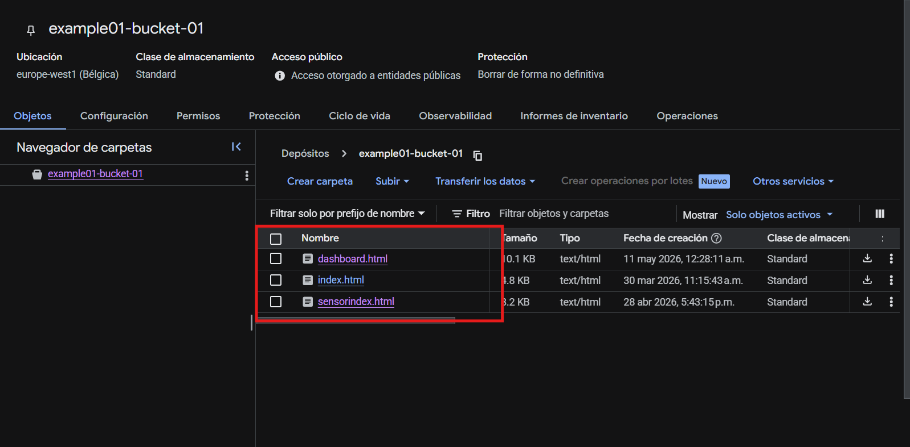

# 🚀 Simulador IoT con Google Cloud Platform

Este proyecto consiste en un ecosistema de Internet de las Cosas (IoT) diseñado para capturar, almacenar y visualizar datos de sensores en tiempo real utilizando la infraestructura de **Google Cloud**.

---

## 🛠 Arquitectura del Sistema

El flujo de datos sigue este camino:

1. **Ingesta**: Una función de servicio recibe los datos del simulador.
2. **Almacenamiento**: Los datos se guardan en una base de datos NoSQL escalable.
3. **Visualización**: Una segunda función recupera los datos para alimentar un Dashboard público.

---

## 📋 Guía de Configuración Paso a Paso

### Paso 1: Persistencia de Datos con Firestore

Configuramos **Google Cloud Firestore** en modo Nativo para gestionar el flujo de datos NoSQL. Esta base de datos permite una sincronización en tiempo real con latencia mínima.

- **Configuración**: Se debe crear una base de datos en la consola de Firebase o GCP.
- **Estructura**: Los datos se organizan en colecciones (ej. `readings`) que contienen los documentos de los sensores.

> 

---

### Paso 2: Función del Servicio IoT (Ingesta)

Esta función actúa como el "cerebro" receptor. Está configurada en **Cloud Run** para recibir peticiones HTTP enviadas por los dispositivos o el simulador.

- **Tecnología**: Implementada mediante **Cloud Build** con despliegue continuo (CI/CD) desde GitHub.
- **Responsabilidad**: Recibir el JSON del sensor, validarlo y escribirlo en Firestore.

> 

---

### Paso 3: Función de Lectura para el Dashboard

Para que los datos sean accesibles por el frontend, creamos una API de lectura que consulta la base de datos.

- **Seguridad**: Configurada para permitir peticiones desde el origen del Dashboard (CORS).
- **Funcionamiento**: Consulta los últimos registros de Firestore y los entrega en formato JSON al cliente.

> 

---

### Paso 4: Alojamiento en Bucket Público

Utilizamos **Google Cloud Storage** para alojar los activos estáticos del Dashboard, asegurando que cualquier usuario pueda acceder a la interfaz.

- **Acceso**: El bucket se configura con acceso de lectura pública (`allUsers` con el rol `Storage Object Viewer`).
- **Contenido**: Aquí se cargan los archivos `index.html`, `css` y `js` que consultan nuestras funciones.
  

---

## ⚡ Tecnologías Utilizadas

- **Google Cloud Run**: Para el despliegue de microservicios sin servidor.
- **Cloud Build**: Para la integración y despliegue continuo.
- **Firestore**: Base de datos NoSQL de alta disponibilidad.
- **Html**: Para el diseño web del simulador y del dashboard.
- **JavaScript**: Para los endpoints y la conexion de los servicios al frontend.
- **Cloud Storage**: Hosting de archivos estáticos a escala global.

## 🔗 Enlaces de Demostración

Puedes interactuar con el sistema a través de los siguientes módulos alojados en Google Cloud Storage:

*   **[Simulador de Sensor IoT](https://storage.googleapis.com/example01-bucket-01/sensorindex.html)**: Interfaz para emular el envío de datos de temperatura y humedad.
*   **[Dashboard de Monitoreo](https://storage.googleapis.com/example01-bucket-01/dashboard.html)**: Panel visual para que el usuario final consulte los datos en tiempo real.
---

**Nota de Implementación**: Al configurar el trigger en **Cloud Build**, asegúrate de definir correctamente el **Punto de entrada** y el **Objetivo de la función** para evitar errores de compilación durante el despliegue automático.
